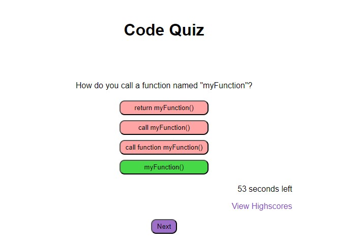

Code Quiz

In this project I created a basic quiz application using javascript, html, and css. Some concepts that were used in this project include the document object model, event listeners, timers, and local storage.

[GitHub Repository](https://github.com/MattOz/Code-Quiz)

[GitHub Live Link](https://mattoz.github.io/Code-Quiz/)

